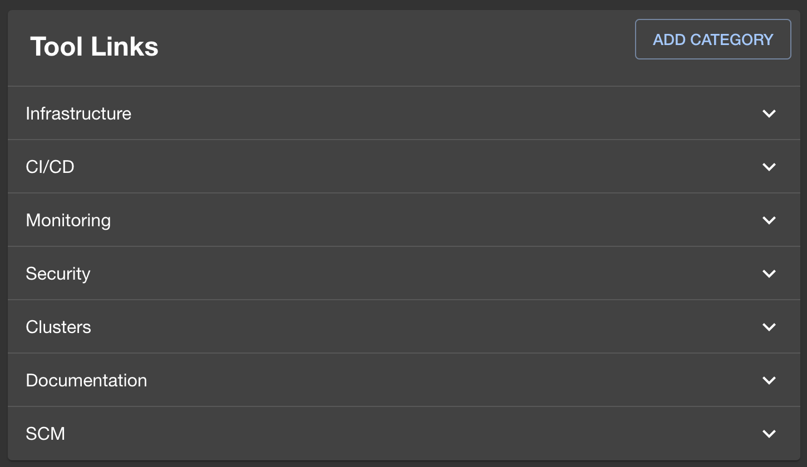
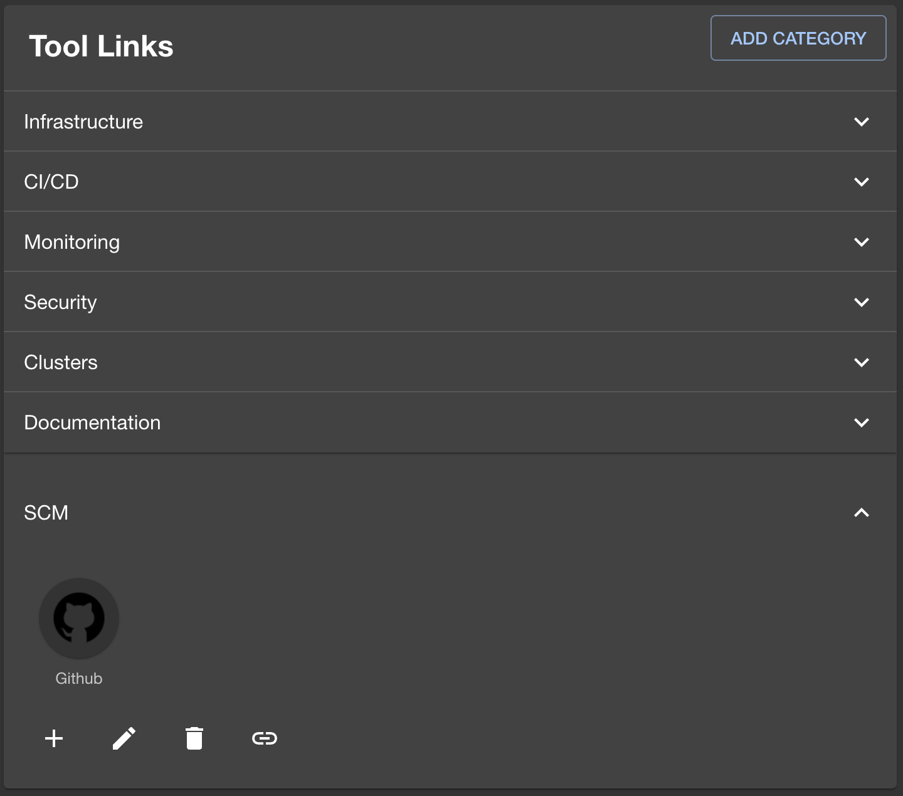
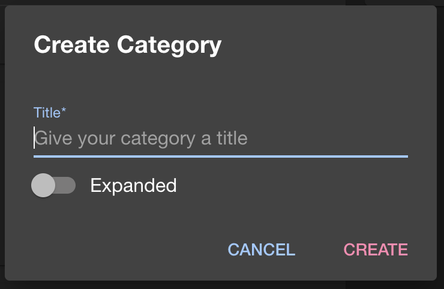
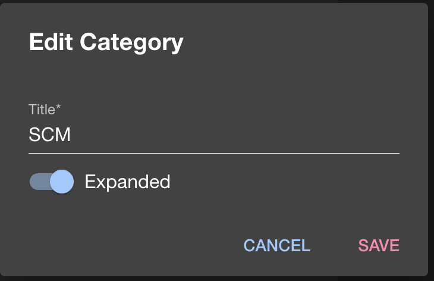
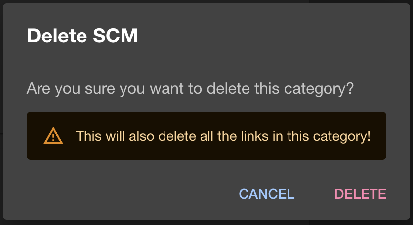
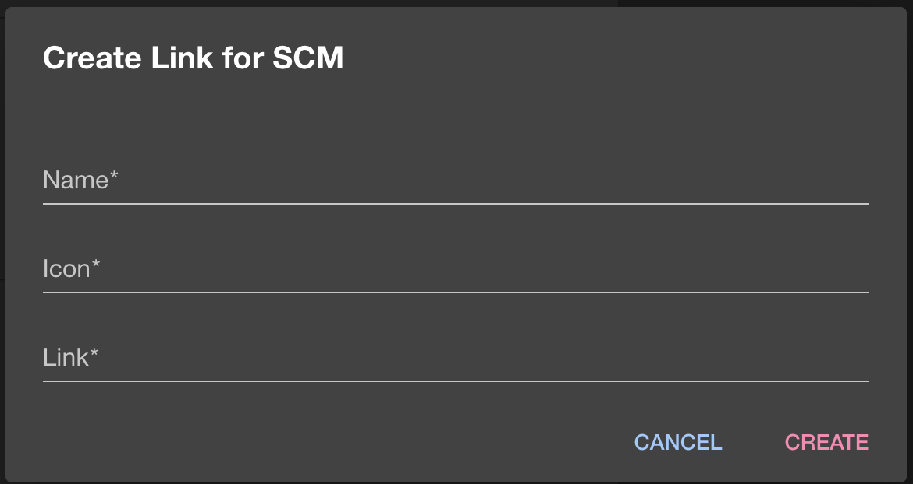
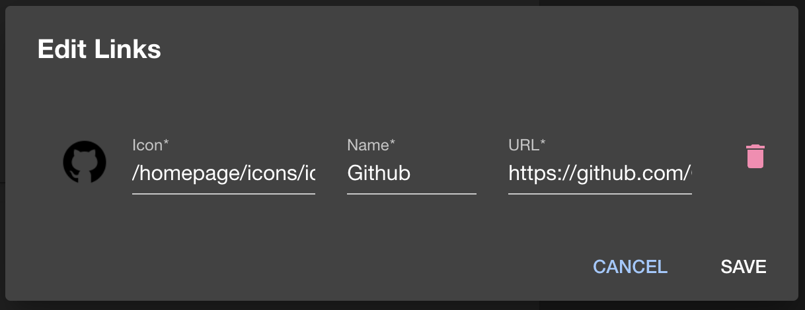

# tool-links

Welcome to the tool-links plugin!

This plugin allows you to add links for external tools to your Backstage instance Homepage.

## Setup

The following sections will help you get the Tool-Links plugin setup and running

### Backend

You need to setup the [Tool-Links backend plugin](https://github.com/platformnow/backstage/tree/master/plugins/tool-links-backend) before you move forward with any of these steps if you haven't already

### Installation

Install this plugin:

```bash
# From your Backstage root directory
yarn --cwd packages/app add @internal/tool-links
```

### Add the plugin to your `packages/app`

Add the root page that the playlist plugin provides to your app. You can
choose any path for the route, but we recommend the following:

```diff
// packages/app/src/App.tsx
+import { ToolLinksComponent } from '@internal/plugin-tool-links';


<FlatRoutes>
  <Route path="/catalog" element={<CatalogIndexPage />} />
  <Route path="/catalog/:namespace/:kind/:name" element={<CatalogEntityPage />}>
    {entityPage}
  </Route>
+ <Route path="/tool-links" element={<ToolLinksComponent />} />
  ...
</FlatRoutes>
```

### Add the Tools Link Component to your Homepage `packages/app/src/components/home`

Add the Tools Link Component to your Homepage so you can Add/Edit/Delete Categories and Links

```diff
// packages/app/src/components/home/Homepage.tsx
+import {ToolLinksComponent} from '@internal/plugin-tool-links';

<Grid container item xs={12}>
+   <Grid item xs={12} md={6}>
+     <ToolLinksComponent />
+   </Grid>
    <Grid item xs={12} md={6}>
      <HomePageStarredEntities title="Favorites" />
    </Grid>
    <Grid item md={6} xs={12}>
      <HomePageRequestedReviewsCard />
    </Grid>
    ...
</Grid>
```

## Features

### View Tool Links



### View Tool Expanded



### Create Category



### Edit Category Name



### Delete Category



### Create Links in a Category

Links can have an Icon image which must be placed in `packages/app/public/homepage/icons`
Otherwise if left blank the default link image can be used.



### Edit Links in a Category


